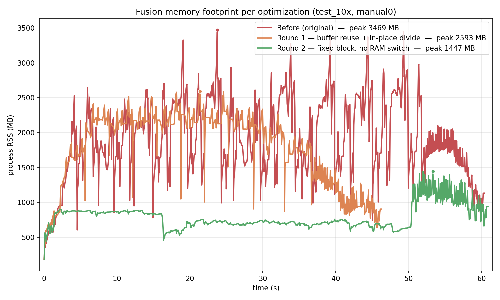

# Stitcher Memory Optimizations — June 2026

*Engineering report. Audience: company / leadership. Covers the memory problems we
found in the stitcher, how we found them, the fixes, and the decisions behind each.*

---

## 1. Executive summary

The stitcher had **unpredictable, unbounded memory use** that crashed a customer's
30 GB machine. We built a memory profiler to *see* where memory went, then shipped
**three rounds of optimization**. The result: fusion now uses a **small, fixed,
predictable amount of RAM on any machine**, and the napari result-viewer no longer
loads whole images into RAM.

| Round | Commit | Area | Before → After |
|---|---|---|---|
| 1 | `a6840e5` | Fusion — allocation churn | peak **3971 → 2527 MB** (−36%), mean −17%, ~20% faster |
| 2 | `62f267a` | Fusion — RAM-adaptive sizing + crash switch | RAM-derived (up to multi-GB / whole-plane) → **fixed ~167 MB, constant** |
| 3 | `e432cbf`, `b047d0b` | Display — napari viewer | eager full-volume load (**unbounded → OOM**) → lazy paging (flat) |

**Measured end-to-end (same machine, same session):** process peak RSS
**3469 → 1447 MB (−58%)** across rounds 1–2 — and the fusion peak fell so far that
it is **no longer the bottleneck**: the remaining peak has moved off the *Fuse*
stage onto *Write*. Round 3 fixed a separate, unbounded display-time leak.

The throughline: every bug was a different flavor of **"use memory proportional to
the problem/machine instead of a bounded constant."** Each fix replaces an
unbounded or machine-dependent pattern with one that is bounded *by construction*.

---

## 2. How we found the problems (method)

Before changing anything we built a **headless memory profiler** (`profiling/`):

- **`psutil` RSS sampling** — the real, total process memory over time (the number
  that actually predicts a crash; cross-platform, no per-OS code).
- **`tracemalloc` attribution** — which Python function allocated what, so a memory
  spike could be tied to a specific line, not guessed at.
- Outputs: a **timeline** (RSS vs. time, stage-annotated), **per-function** memory
  lines, and a **Pareto** ranking (which functions dominate integrated memory).

This is what turned "it crashes sometimes" into "function X holds Y MB at stage Z."
Two facts it surfaced immediately:

- **Fusion**, not registration, dominated memory (contrary to first assumption).
- **Two functions explained ~96% of integrated memory** — a clear target.

> **Key principle that emerged:** the only number that matters for crashes is
> **process RSS**. OS page cache (which can look like tens of GB in a system
> monitor) is reclaimable and irrelevant — it never causes an OOM. We measure RSS.

---

## 3. The three optimizations (long form)

### Round 1 — Fusion allocation churn  ·  `a6840e5`
**"perf(fuse): reuse block buffers + in-place divide + honest sizing"**

**The bad pattern.** Fusion processes the output mosaic in blocks. For *every*
block it (a) re-allocated two large `float32` accumulators (`fused` + `weight`)
with `np.zeros`/`np.zeros_like`, and (b) normalized with a fancy-indexed masked
divide `fused[mask] /= weight[mask]`, which allocates large temporary arrays. On
top of that, the block-size budget under-estimated bytes-per-pixel
(`8*channels` instead of the true `~12*channels`), so the "safe" RAM budget could
silently overshoot toward ~4 GB.

**How I found it.** The profiler's Pareto ranking showed
`_fuse_tiles_chunked_plane` + `numpy zeros_like` ≈ **96% of integrated memory**,
and the timeline showed a volatile **sawtooth** — the signature of per-iteration
allocation and release.

**The fix (output-identical).**
1. **Allocate the block buffers once**, before the loop; zero and sub-view them per
   block instead of re-allocating — kills the `zeros_like` churn and the sawtooth.
2. **In-place masked divide** `np.divide(fused, weight, out=fused, where=mask)` —
   removes the fancy-index temporaries.
3. **Honest sizing** `bytes_per_pixel = 12*channels` — the budget now reflects the
   true transient cost, so the ceiling is real, not optimistic.

**The decision.** This had to be **provably output-identical** — it's a perf change
to scientific output. I wrote `tests/test_fuse_equivalence.py` asserting the chunked
result is byte-identical to a full-plane reference, and only shipped after it + the
full fusion/integration suites passed (20/20).

**Result.** Peak RSS **3971 → 2527 MB (−36%)**, mean **2225 → 1842 MB (−17%)**,
and ~20% faster (less allocation churn) — measured over 3 runs each.

---

### Round 2 — RAM-adaptive sizing & the crash switch  ·  `62f267a`
**"perf(fuse): fixed-size fusion block, remove RAM-derived sizing + full-plane switch"**

**The bad pattern (this is the one that crashed the customer).** The fusion block
size was **computed from the machine's free RAM** (`psutil` → `block_size =
sqrt(available_ram * fraction / bytes_per_pixel)`), capped by an arbitrary constant
(10240), with a **silent fallback**: if a single block could span the whole image,
it switched to allocating the **entire fused plane** in RAM. So:

- More RAM on the machine → *bigger* allocation (the opposite of safe).
- Past a threshold, the knob didn't just resize the block — it **changed the
  algorithm** to a whole-plane load, with only a `print()` as warning.
- The ceiling was **advisory, decided once, never enforced.**

On a 30 GB customer machine this resolved to a multi-GB block (or the whole-plane
path) and filled RAM.

**How I found it.** Tracing the customer crash through `_fuse_tiles_chunked_plane`,
then a `git blame`/pickaxe forensic: the switch was **introduced as a feature**
("Add memory-efficient chunked fusion mode") on top of the imported qi2lab base —
it was *not* inherited. The bug was in the attempt to add memory-safety, not in the
original code.

**The decision — the key engineering insight.** The right design is **not** "let it
grow, then clamp it" (a band-aid on an unbounded function). Fusion is a *streaming
write*: you never need more than one output block resident, and the block size
should be a **fixed constant tied to the storage layout**, never a function of the
machine. So:

- Deleted `psutil`, the RAM fraction, the arbitrary cap, **and the switch**.
- Fixed `block_size = chunk_y * 2` (one storage shard per side).
- Memory is now **constant ~167 MB at fusion, identical on an 8 GB laptop or a
  1 TB workstation**, and it can never fall back to a whole-plane load.

We also confirmed the FOV (the only large input piece) is small and read one at a
time — Squid's default is 2084×2084 (~9 MB/plane) — so the input side was never the
risk; the output scratchpad was.

**Result.** The fusion *scratchpad* is now a fixed **~167 MB** (the lever); the
measured *process* peak fell to **1447 MB** — low enough that the peak moved off the
*Fuse* stage entirely (onto *Write*). Bounded by construction, flat, and
machine-independent. (Lowest, flattest curve in the overlay below.)

---

### Round 3 — napari display loaded whole images  ·  `e432cbf`, `b047d0b`
**"lazy-load napari viewer" + "read napari layers via tensorstore+dask"**

**The bad pattern.** Stitching stayed bounded (~6 GB peak), but clicking *"Open in
Napari"* filled RAM completely. The viewer **eagerly read whole volumes** into RAM
(`store[...].read().result()` → `np.asarray`) and handed napari a plain numpy block
— all z, all timepoints, every channel at once, with no pyramid for lazy rendering.
Ironically, stitching *streamed* while display did the exact opposite.

**How I found it.** The user reported the OOM; I read the viewer code and found the
eager reads, and contrasted them with the project's own standalone
`view_in_napari.py`, which already loaded data **lazily**.

**The fix.** Hand napari the **multiscale pyramid as lazy arrays** so it pages only
the chunk/level currently on screen — RAM stays flat regardless of dataset size.

**The follow-up bug (`b047d0b`) and decision.** The first attempt (`e432cbf`) used
`ome-zarr`'s `parse_url`, which **returns `None`** when it can't open a store. On a
machine whose `ome-zarr` couldn't read our **Zarr v3** output, that `None` flowed
into the reader and produced the cryptic `'NoneType' object has no attribute
'exists'`. The decision: **drop the fragile reader** and open each level with
**tensorstore** — the same engine that *wrote* the store, so it always reads our v3
output — wrapped in a **dask** array for lazy paging. Robust across machines, no
version dependency.

**Result.** Display memory is **flat/lazy** instead of unbounded. This round is
**not on the fusion overlay** below: it's a different process and phase (display,
not the stitching pipeline), and its "before" was *unbounded* — there is no finite
curve to plot because it crashed. That, in itself, is the result.

---

## 4. The memory-footprint overlay (per optimization)

*One curve per optimization, same dataset (`test_10x`, region `manual0`,
27 FOVs × 10 z × 4 ch), same machine, same session. Peak RSS is annotated per
curve.*

**Peaks (this overlay run):**

| Curve | Commit | Peak RSS | Peak stage |
|---|---|---|---|
| Before (original) | `8f6ca44` (round-1 parent) | **3469 MB** | Fuse |
| Round 1 — buffer reuse + in-place divide | `a6840e5` | **2593 MB** | Fuse |
| Round 2 — fixed block, no RAM switch | `62f267a` | **1447 MB** | **Write** |

End-to-end: **3469 → 1447 MB, −58%.** (Round 1 was independently confirmed at
−36% over 3 runs earlier — 3971 → 2527 MB; baseline/round-1 numbers vary
run-to-run *because their block size was RAM-dependent* — precisely the
non-determinism round 2 removes. Round 2 is reproducible.)

**How to read it:**
- **Lower and flatter is better.** Red (before) is high with a violent **sawtooth**
  — the signature of per-block re-allocation. Amber (round 1) is lower and smoother.
  Green (round 2) is a low, flat plateau.
- **The decisive result:** at round 2 the peak **leaves the Fuse stage entirely**
  (it now sits in *Write*). Fusion got so cheap it's no longer the bottleneck — we
  squeezed it below every other stage.
- Round 2 is also **independent of the machine's RAM**, which is what eliminates the
  crash class (a bigger machine no longer means a bigger allocation).

---

## 5. Bad-pattern catalogue (the transferable lessons)

| Bad pattern | Why it hurts | The fix |
|---|---|---|
| **Grow-then-clamp** (size from free RAM, then cap) | Advisory ceiling, never enforced; more RAM → bigger allocation | Bound **by construction** — a fixed constant tied to the data layout |
| **Silent algorithm-switching fallback** | A tuning knob secretly changes the algorithm (block → whole-plane) at an undocumented threshold | One bounded path, no fallbacks |
| **Re-allocation inside a loop** | Per-iteration churn, volatile peaks, GC pressure | Allocate once, reuse (zero + sub-view) |
| **Eager full-load when streaming is possible** | Holds the whole problem in RAM | Stream / page one piece at a time |
| **Trusting a fragile reader** (`ome-zarr` on Zarr v3) | Silent `None` on failure → cryptic crash | Use the engine that wrote the data (tensorstore) |

**One-line takeaway for the meeting:** *the stitcher's memory is now bounded by
design, not by luck — it uses a small constant amount on any machine, proven by
measurement and guarded by tests.*

---

## 6. Validation

- **Output unchanged:** `tests/test_fuse_equivalence.py` asserts chunked fusion is
  byte-identical to the full-plane reference; full fusion + integration suites pass.
- **Measured, not asserted:** every memory claim is backed by `profiling/` runs on
  the real `test_10x` dataset (the overlay above).
- **Reproducible:** `python -m profiling.cli <dataset> --region manual0 --out <dir>`
  per commit, overlaid with `python -m profiling.overlay_commits`.
- **Raw data included:** the three timelines behind the overlay are in
  `docs/memory-overlay/{baseline,round1,round2}.csv` (RSS vs. time, stage-tagged).
